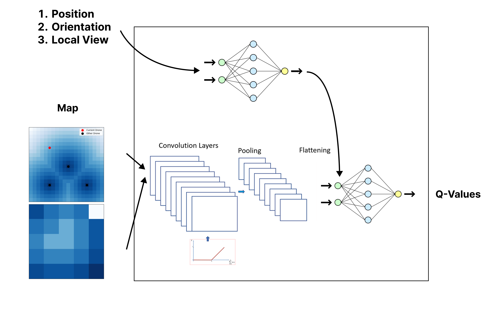

# Multi-UAV-For-Agriculture

This project presents a deep reinforcement learning approach to multi-agent coverage path planning for agricultural Unmanned Aerial Vehicles (UAVs). 

We propose a scalable framework addressing the challenges of maintaining stable flight patterns for uniform chemical applications while coordinating multiple agents. Our approach features a customizable environment supporting mixed training scenarios, a generalized state representation for shared learning across agents, and an adaptive neural network architecture incorporating distance-based spatial transformations and agriculture-specific reward structures. 

Experimental results demonstrate optimal coverage patterns with minimal steps in ideal scenarios, successfully developing both individual and cooperative behaviors. While the framework exhibits effective performance scaling across different map dimensions and agent numbers through our Double Deep Q-Network implementation, we identified limitations in collision avoidance that increase with agent density. 

The system shows particular strength in generating efficient straight-line trajectories, demonstrating significant improvements over traditional methods and suggesting broader applications for this distance field-based architecture in multi-agent systems beyond coverage and agricultural scenarios.

